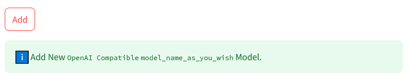

# Add OpenAi compatible service provider

For model providers with OpenAI-compatible APIs that are not built-in supported, such as local LLM inference engines like `vllm` or service providers like `01.AI` or `Qwen`, you can easily add them via the `OpenAI compatible` option.

**Note**: request parameters for OpenAI compatible may or may not support.

## Step1. select OpenAI compatible option to start configuration

## Step 2. input necessary information, then save

Refer to the model's official API documentation to find necessary information, such as base_url, api_key, model name, request parameters if supported. Then input these information in `Add New OpenAI Compatible model` section.

### example1: add a local LLM model without request parameters (vllm)

Referece: [https://docs.vllm.ai/en/latest/serving/openai_compatible_server.html](https://docs.vllm.ai/en/latest/serving/openai_compatible_server.html).

After starting the vllm server:

1. Find the `base_url`: `http://localhost:8000/v1` in the example code on the official API documentation page.

2. Enter the required information. The `model alias`, `model name`, `base_url`, `api_key` options are mandatory, other values should be set accordingly. Leave the request parameters blank as the app currently does not support customization of vllm request parameters.

> **Note**: Refer to the API documentation for proper format of `model_name`, such as `NousResearch/Meta-Llama-3-8B-Instruct` in the example code on the web page. The `api_key` should be set according to the vllm setting, 

3. Click `add` once the input is finished.

4. Check on `Chat`.

Select `vllm_model_name_as_you_wish` in the `Chat Model Configuration`, start chatting. Since no request parameters are set for the model, a warning message will appear on the page.

### example2: add a local LLM with request parameters (lm studio)

Reference: [https://lmstudio.ai/docs/local-server](https://lmstudio.ai/docs/local-server).

Similar to example 1, enter the required information, the `model_name`, `base_url`, and `api key` should be set according to LM Studio settings. The supported request parameters are shown in the offical API documentation page, but support may vary depending on the model. For example, `top_k` is not supported by mistral-instruct 7b:v0.2 model. 

In this example, `seed`, `temperature`,`top_p`, and `max_tokens` are set as the request parameters.

check on `chat` , the request parameters of `seed`, `temperature`, `top_p`, and `max_tokens` are dsiplayed on the page.

### example3: add a remote LLM with request parameters (01.Yi)

Reference: [https://platform.lingyiwanwu.com/docs/api-reference](https://platform.lingyiwanwu.com/docs/api-reference).

1. find base_url: `https://api.lingyiwanwu.com/v1`:

2. find request parameters. It suports `max_tokens`, `top_p`, `temperature` and other request parameters. 

>  **Note**:  there is no need to set `stream` because the app always use `stream=true`.

3. add to app

4. check on `chat` page.

### example4: add a remote LLM with request parameters (Qwen)

Reference: https://help.aliyun.com/zh/model-studio/developer-reference/use-qwen-by-calling-api.

Find `base_url`, supported request parameters on the official API documentation page. Enter the required information.

# A flexible way to use alternative providers

One flexible way to use providers that are not natively supported in the app is to use third-party services like [one-api](https://github.com/songquanpeng/one-api) as intermediaries.

