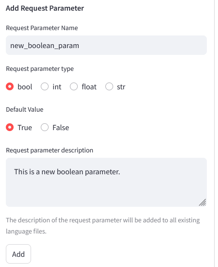

# Specify the request parameters of the model

## add request parameters

You can specify the request parameters for each model (excluding ollama models, which are set uniformly) in the `model settings`.  Simply enter the names of the request parameters in `request parameters`, using `,` to separate multiple parameters:

After specifying, you can set the values of the request parameters in Chat/Completion.

> **Note**:
>
> - All request parameters are optional.

The layout of request parameter options shown on Chat/Completion page is determined by the order of parameters in `model settings`. For example, if you list `seed`, `temperature`, `top_p`, and `max_tokens` , the first two will appear on the left side of block, others are shown on the right side.

## request parameter errors

If you see the following error message, it means that the model does not support some of the request parameters you added. For example, the model does not support the `top_k` parameter as shown in the screenshot below:

Simply remove `top_k` from the request parameters, save the model settings, and go to Chat/Completion to restart it.

> **Note**: Different models support different parameters, recommendations are given in `request parameters` section of the `llm settings` , but you may need to adjust them depending on the model used. 

# add a new request parameter

The app provides 15 request parameters, see the `request parameters` section of `llm settings` for explainations of the parameters. You can add a new request parameter in `customize request parameter` section by following these steps:

1. Enter the name of parameter
1. Choose a data type for the parameter. Four types of request parameters are supported: boolean, integer, float, and string.
1. Set the default value. If parameter is numeric, you also need to set the minimum, maximum, and adjustment step for the parameter.
1. Enter the description of the parameter. The description will be automactically add to all existing language files.
1. Click `add`. Once clicked, the app will reload to load the newly added language file.

Add a boolen parameter:

Add an integer parameter:

Add a float parameter

Add a string parameter

After adding, you also can find the description of these parameters in the `customized request parameters` under the block of`request parameters`.

Now you can add them to model settings, and set their values on the Chat/Completion page.

